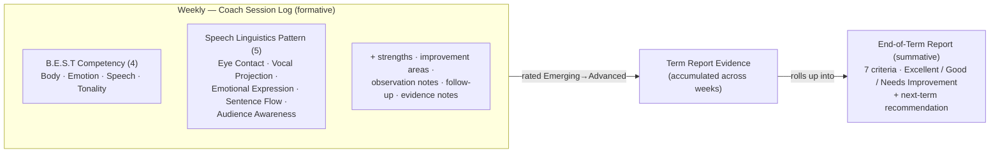
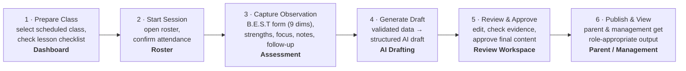
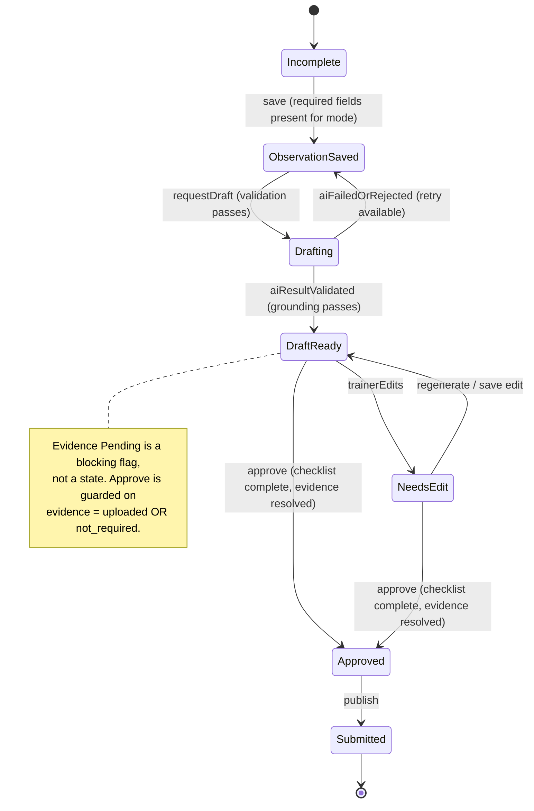
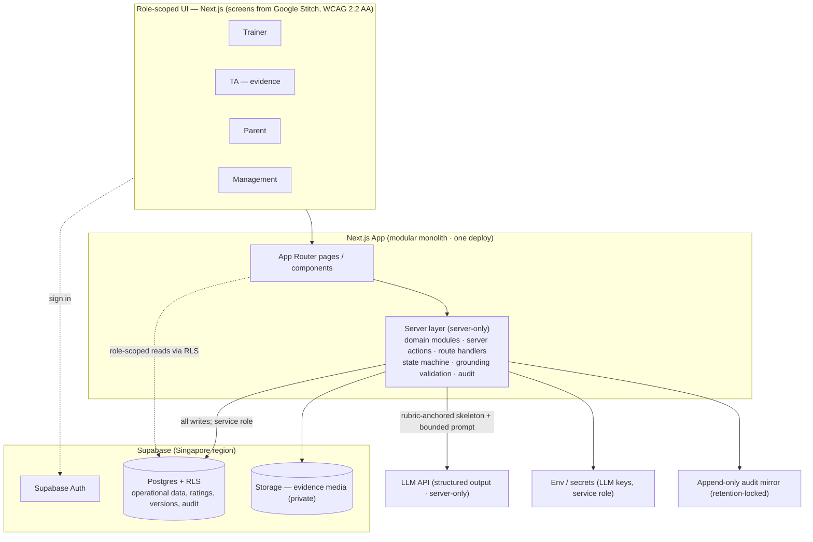
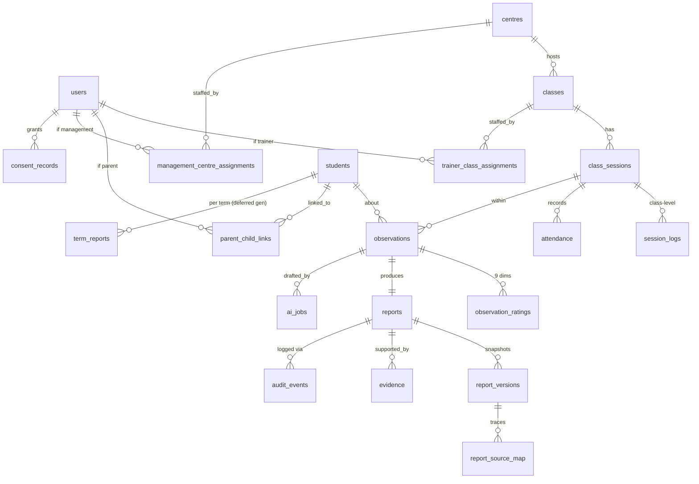

# B.E.S.T Coach — Complete MVP Prototype Specification (v3)

**by SpeakFlow AI**
**Prepared for:** iSpeak Academy / Speech Academy Asia — Service Design Project
**Status:** Authoritative build specification · Evolutionary MVP
**Supersedes:** v2 of this specification (and v1 / the earlier base-design PDF / standalone architecture doc)
**v2 change:** Replaced the placeholder assessment criteria with the client's real **B.E.S.T. Method™** framework, sourced from the Coach Session Log and End-of-Term Performance Report.
**v3 change:** Brings the spec into agreement with the *AI Features Breakdown (v2)* document by specifying the two future AI features in detail and extending the grounding model to aggregates. Both features remain **deferred / post-MVP roadmap** — the MVP is built *ready* for them but does not include them. Changes touch §12 and §24 (aggregate grounding), a new §14.1 (governance positions), §28 (roadmap detail), and the glossary. The Part I–II product content, the architecture decisions (§16–§23), and the **MVP build plan (§26) are unchanged**.

---

## How to read this document

Five parts plus appendices:

- **Part I — Product:** what the product is, the assessment framework at its core, who it serves, and its edges.
- **Part II — Experience:** screens, features, and the end-to-end service flow.
- **Part III — Governance:** the rules and mechanisms that make the product trustworthy.
- **Part IV — Architecture:** the buildable system, locked to your toolchain.
- **Part V — Delivery:** how it gets built with Stitch + Claude Code under your orchestration.

The single operating principle running through the whole document:

> **AI drafts. Trainers approve. Parents and management see only approved reports.**

And the single substantive core:

> **The B.E.S.T. Method™ is the assessment framework every observation, draft, report, and statistic is built on (§3).**

---

## Table of Contents

**Part I — Product Definition**
1. Executive Summary
2. Problem & Service Promise
3. **The B.E.S.T Assessment Framework**
4. Design Principles
5. Stakeholders & Value
6. Scope & Boundaries

**Part II — Service Experience**
7. End-to-End Service Flow
8. Screen & Page Inventory
9. Feature Set by Phase
10. Operational Service Blueprint

**Part III — Governance & Behaviour**
11. The AI Feedback Draft Assistant
12. Anti-Fabrication — The Grounding Design
13. Report Lifecycle & State Machine
14. Roles & Data-Access Boundaries
15. Failure & Recovery

**Part IV — System Architecture**
16. Architecture Decisions (Locked)
17. High-Level Architecture
18. Modular Monolith Structure
19. Technology Stack
20. Data Model
21. Security & Access Control
22. Privacy & Compliance (PDPA)
23. Audit & Accountability
24. AI Drafting Subsystem — Implementation

**Part V — Delivery**
25. Toolchain & Workflow
26. Build Plan — Evolutionary MVP
27. Non-Negotiables at Speed
28. Out of Scope & Roadmap
    - 28.1 Future AI Feature — Weekly Class Health Brief (post-MVP)
    - 28.2 Future AI Feature — Child Progress Digest (post-MVP)

**Appendices**
- A. One-Page Operating Logic
- B. Integrity-Critical Design Decisions
- C. Glossary

---

# Part I — Product Definition

## 1. Executive Summary

B.E.S.T Coach by SpeakFlow AI is a **human-in-the-loop education reporting service** for iSpeak Academy / Speech Academy. It helps trainers prepare for scheduled classes, record structured observations against the academy's **B.E.S.T. Method™** assessment framework, generate AI-assisted feedback drafts, review supporting evidence, and approve final reports that parents and management can trust.

It is deliberately **not** an automated grading system. The trainer remains the professional decision-maker; the AI is a drafting assistant that turns validated observations into readable report language and then hands control back. Its purpose is to reduce manual reporting burden, increase consistency across trainers and centres, support seamless trainer/relief handovers, make student progress understandable to parents, and give management operational visibility — all without letting unreviewed AI output reach a family.

The assessment framework at its core (§3) operates on **two timescales**: a **per-session Coach Session Log** (formative, the trainer's live observation instrument) and a **per-term End-of-Term Performance Report** (summative). The weekly logs are the designed evidence pipeline that rolls up into the term report.

This document specifies the **current base-design prototype** as an **evolutionary MVP**: real, buildable software, built fast on a managed stack — **Supabase** (Postgres + Auth + Storage + Row-Level Security) and **Next.js**, with UI screens generated in **Google Stitch** and the system coded by **Claude Code** under the user's orchestration. Schedules and records are synthetic for this MVP.

## 2. Problem & Service Promise

**The problem.** Trainer-written progress reporting is slow, inconsistent between trainers, and often opaque to parents. Continuity across weeks and relief trainers is fragile, and management lacks a reliable, low-effort view of whether reporting is complete and what class-level patterns are emerging.

**The service promise.** B.E.S.T Coach turns structured B.E.S.T observations into clear, consistent, trainer-approved progress updates — protecting professional judgement, supporting trainer handovers, and preserving parent trust.

## 3. The B.E.S.T Assessment Framework

B.E.S.T is the assessment method at the **core of the entire application**. Every observation, draft, report, and statistic is built on it. It is a trademarked method (**B.E.S.T. Method™**) that the academy applies through **two instruments on two timescales**, with a designed pipeline from one to the other.



### 3.1 Instrument 1 — Coach Session Log (formative, per session)

The trainer's live observation instrument. It captures **two rating layers** plus continuity and class context.

**Layer A — B.E.S.T Competency (4 dimensions):**

| Dimension | Focus |
|---|---|
| **Body** | Posture & Gesture |
| **Emotion** | Facial Expression |
| **Speech** | Clarity & Structure |
| **Tonality** | Voice Control |

**Layer B — Speech Linguistics Pattern (5 dimensions):** Eye Contact · Vocal Projection · Emotional Expression · Sentence Flow · Audience Awareness.

**All 9 dimensions** are rated on a four-level scale: **Emerging / Developing / Secure / Advanced** (anchors in §3.3).

**Plus, on the same log:** observation notes; student strengths; areas for improvement; **follow-up for next session** (continuity — what the next trainer should reinforce); **term-report evidence notes**; relief-teacher handover; and **class-level context** (lesson delivery checklist, lesson summary, class engagement/behaviour/pacing, trainer reflection).

### 3.2 Instrument 2 — End-of-Term Performance Report (summative, per term)

A different rubric and a different scale.

**7 criteria:** Body Language · Use of Emotions · Speech Structure · Tonality & Voice Projection · Clarity of Speech · Confidence & Stage Presence · Audience Engagement.
**Scale:** **Excellent / Good / Needs Improvement.**
**Plus:** a next-term recommendation — Continue in current level / Move to next level / Additional support recommended.

### 3.3 The rubric anchors — the grounding system's backbone

Each four-level rating has a precise behavioural definition. These anchors are the single most valuable input to the anti-fabrication design (§12): they let the system carry the *meaning* of each rating into bounded AI generation.

| Rating | Behavioural anchor | Polarity band (used by grounding) |
|---|---|---|
| **Emerging** | Requires frequent prompting, modelling, and support to demonstrate the skill consistently. | `needs_support` |
| **Developing** | Demonstrates the skill with some guidance and increasing confidence, but consistency may still vary. | `developing` |
| **Secure** | Demonstrates the skill independently and consistently across most classroom activities and presentations. | `positive` |
| **Advanced** | Exceeds the expected level: strong confidence, natural expression, independent application, consistent across different contexts. | `positive` (exceeds) |

### 3.4 The formative → summative pipeline

The weekly Coach Session Logs are the **evidence that rolls up into the term report** — the log itself carries a dedicated "Term Report Evidence Notes" field for exactly this purpose. The MVP therefore **captures term-report evidence from day one** while **deferring term-report generation** to a later phase (the pipeline exists; the generator is built later).

### 3.5 Decisions taken (locked)

| # | Decision | Resolution |
|---|---|---|
| 1 | Form scope | Capture **all 9 dimensions** (4 Competency + 5 Speech Linguistics) to match the client's real log, with a streamlined **quick mode** (the core 4 Competency dimensions) for live-class speed. |
| 2 | Per-session scale | Standardise the app on **Emerging / Developing / Secure / Advanced**, with a defined default map to Excellent/Good/Needs Improvement for term-report generation. |
| 3 | Term report | **Capture evidence now, defer generation.** Per-session parent feedback is the in-scope core; the term roll-up is a later phase, but its evidence pipeline exists from day one. |
| 4 | Continuity | **First-class feature.** "Follow-up for next session" feeds the next session's "previous focus" in Phase 1; full relief-teacher handover UI is a later phase. |

### 3.6 Framework inconsistencies to ratify with the client

The client's two source documents are not fully consistent. These are **decisions for the client to confirm**, not blockers; the app resolves them into one coherent model, but the academy should ratify the canonical version.

1. **What "S" stands for / the acronym gloss.** The Session Log treats B.E.S.T as **Body · Emotion · Speech · Tonality**; the Term Report glosses it as **Body Language · Emotions · Structure · Tonality** — i.e. "S" = *Speech* in one and *Structure* in the other, and the Term Report additionally splits Speech into "Speech Structure" + "Clarity of Speech". **Proposed canonical (pending ratification):** the method's four pillars are **Body, Emotion, Speech, Tonality** (the formative log), with the term report's seven criteria treated as the summative expansion.
2. **9 formative dimensions vs 7 summative criteria** — there is no 1:1 mapping. A session-dimension → term-criterion roll-up map must be defined when term-report generation is built (indicative mapping noted in §28); client to ratify.
3. **Two scales** — 4-level formative vs 3-level summative. **Proposed default map (pending ratification, trainer-overridable):** Advanced → Excellent, Secure → Good, Developing → Needs Improvement, Emerging → Needs Improvement. Used only when term generation is built; the trainer always retains final say (per §4).

> **Open question for the client:** is there a *canonical* version of the seven-vs-nine dimensions and the two scales they consider authoritative, or are both instruments live and the app is meant to bridge them? That answer decides whether the app standardises on one model or formally maintains both. The architecture below supports either.

## 4. Design Principles

| Principle | What it means in the prototype |
|---|---|
| **Trainer remains accountable** | The trainer selects B.E.S.T ratings, adds context, edits the report, and decides whether to publish. |
| **AI is a drafting assistant** | AI converts validated observation inputs into report language. It does not independently assess, grade, or publish. |
| **Role-appropriate visibility** | Parents receive only approved parent-facing reports; management receives approved completion, evidence, and class statistics **for their own branch/centre only** — there is no cross-branch or HQ view in this MVP. |
| **Continuity is preserved** | Each session's follow-up notes carry forward to support the next trainer or a relief trainer. |
| **Evidence supports judgement** | TA-uploaded evidence can support trainer review but never triggers automated scoring. |

## 5. Stakeholders & Value

| Stakeholder | Primary role | Value received |
|---|---|---|
| **Trainer** | Prepares classes; observes against B.E.S.T; assesses; edits; approves reports. | Structured workflow, reduced writing effort, controlled AI drafting, accountability over final feedback, continuity across weeks. |
| **Teaching Assistant (TA)** | Supports delivery; uploads evidence where required. | Clear evidence workflow without authority to approve reports. |
| **Parent** | Views a child's approved progress reports and practice guidance. | Simple, supportive updates — no internal notes, raw ratings, or unfinished drafts. |
| **Management** | Monitors approved reporting completion, evidence status, alerts, and class trends **for their own branch/centre**. | Operational visibility without access to unapproved drafts, internal notes, or other centres' data. |

## 6. Scope & Boundaries

| Included in current base design | Explicitly excluded or deferred |
|---|---|
| Trainer dashboard, calendar, lesson checklist, roster, **B.E.S.T form (9 dimensions, quick + full mode)**, report drafting, review/approval workflow. | Real notifications infrastructure, automated video analysis, autonomous grading, **cross-branch/HQ administration** (org-wide rollups, branch provisioning, a corporate oversight tier that sees across branches). |
| **Continuity:** per-session follow-up notes carried into the next session's "previous focus." | **Term-report generation** (evidence captured now; generator deferred) and **full relief-teacher handover UI** (schema-ready; UI deferred). |
| **Term-report evidence capture**; class-level session data (engagement/behaviour/pacing/checklist). | Future Weekly Class Health Brief and Child Progress Digest (the class-level data captured now feeds the former). |
| TA evidence upload/re-upload; parent calendar and feedback report; management calendar, class overview, class statistics. | — |
| **Branch-scoped management access:** each management account is assigned to one centre and sees only that centre's classes, reports, and statistics, enforced via RLS (§14, §20). | — |
| Three response designs: incomplete observations, future-session restriction, unapproved parent report. | Any workflow where AI publishes content directly to a parent or changes a trainer-selected rating. |

---

# Part II — Service Experience

## 7. End-to-End Service Flow

A trainer-led assessment and reporting workflow. AI drafts; the trainer approves.



> **Governance rule:** AI never assesses or publishes independently. Only trainer-approved reports become visible to parents and management.

## 8. Screen & Page Inventory

Each screen is generated as a Stitch screen, then adapted by Claude Code into the Next.js app.

### Trainer screens

**Trainer Dashboard** — *Before-class control centre.*
Monthly calendar and selected-day classes; selected-class details (unit/theme, focus, trainer/TA, student count); lesson checklist with **Start Class**.

**Assessment — Roster Mode** — *Live class workspace.*
Student grid with presence, **previous focus (carried from last session's follow-up)**, and report status; drafted/approved/absent counters; Assess / Continue / Review actions; filter and sort controls.

**Assessment — B.E.S.T Form** — *Focused student observation, the capture core.*
- **Layer A — B.E.S.T Competency (4):** Body, Emotion, Speech, Tonality.
- **Layer B — Speech Linguistics Pattern (5):** Eye Contact, Vocal Projection, Emotional Expression, Sentence Flow, Audience Awareness.
- Each rated **Emerging / Developing / Secure / Advanced** via chips, with the rubric anchor available on hover/tap (so trainers rate consistently).
- **Mode toggle:** *Quick* (core 4 Competency dimensions, for live-class speed) or *Full* (all 9). Completion validation adapts to the selected mode.
- Strength chips, improvement-focus chips, and trainer observation notes.
- **Follow-up for next session** (continuity) and **term-report evidence notes** (optional, captured now).
- **Save & Generate Draft**, **Save & Next**, **Back to Roster**.

**Review & Approve** — *Post-class quality control (Trainer / TA).*
Draft Queue, Feedback Preview, Evidence & Approval panels; edit, regenerate, simplify, encouraging-tone, compare-with-notes controls; trainer approval checklist and **Approve & Submit** gate.

### Parent screens

**Parent Calendar** — *Parent portal landing.*
Monthly calendar with parent-friendly status labels; selected-day report cards with **View Report**; optional calm pending state ("Progress update being prepared").

**Parent Feedback Report** — *Child-specific approved update for one session.*
Today's strength, next focus, practice suggestion, session takeaway; coaching context and simplified performance summary; **no internal notes, raw B.E.S.T ratings, or AI draft history**.

### Management screens

**Management Calendar** — *Date-based reporting & follow-up view.*
Calendar status markers and selected-day class list; reports-submitted, evidence-uploaded, parent-alert metrics; **View Class** drill-down.

**Management Class Overview** — *Operational monitoring for one class.*
KPI cards, Student Report Status table, recent activity, Class Health Summary; View Class Statistics.

**Class Statistics** — *Class-level trends from approved reports.*
B.E.S.T category patterns and progress-over-sessions chart; students needing follow-up; evidence/report-quality status; Management Insight card — **no unapproved drafts or internal notes**.

## 9. Feature Set by Phase

| Phase | Feature set | Primary benefit |
|---|---|---|
| **Before-class preparation** | Dashboard, calendar, selected-class details, lesson checklist, Start Class. | Reduces preparation ambiguity; consistent starting point. |
| **Live assessment** | Roster cards with previous focus, attendance states, **9-dimension B.E.S.T form** (quick/full), strength/focus chips, notes, follow-up. | Supports quick, structured, continuity-aware observation during a live class. |
| **AI feedback drafting** | Validated B.E.S.T input + notes produce a multi-audience draft, grounded in the rubric anchors. | Reduces repetitive writing while preserving trainer authority. |
| **Review & approval** | Draft Queue, editable preview, evidence panel, approval checklist, submit confirmation. | Prevents unreviewed AI output from reaching parents/management. |
| **Parent access** | Parent Calendar and trainer-approved feedback report. | Makes progress understandable, practical, and safe for family viewing. |
| **Management visibility** | Management Calendar, Class Overview, Class Statistics. | Shows reporting completeness and approved class-level patterns. |
| **Response design** | Validation, session lock, parent-pending states. | Protects service quality and guides recovery rather than just showing errors. |

## 10. Operational Service Blueprint

Scope: one scheduled class session, from trainer preparation to approved parent and management visibility.

| Phase | User action | Frontstage response | Backstage / system work | Output / handoff |
|---|---|---|---|---|
| **Prepare Class** | Sign in, select scheduled class, check prep list. | Dashboard shows class details and checklist. | Authenticate; retrieve mock schedule, roster, unit, focus, TA, checklist. | Correct session context before class. |
| **Start Session** | Click Start Class, check roster, record attendance. | Roster shows student states, previous focus, and progress counters. | Validate session availability; create active session; initialise attendance. | Live assessment workspace available. |
| **Capture Observation** | Assess each student (9 B.E.S.T dimensions, strengths, focus, notes, follow-up). | Form validates required fields per mode; preserves work. | Store structured observation + per-dimension ratings linked to class/session/student/trainer. | Structured observation record + continuity note. |
| **Draft + Evidence** | Request draft; TA may upload media. | Status moves Drafting → Draft Ready; evidence panel updates. | Build rubric-anchored skeleton; run AI draft; store schema-valid draft + evidence metadata. | Private AI draft and evidence state. |
| **Review + Approve** | Edit content, check evidence, submit approval. | Review workspace and confirmation support the decision. | Store approved version, timestamp, approver, audit log. | Final submitted report. |
| **Publish + View** | Parent views report; management views status + statistics. | Parent sees simplified report; management sees completion and trends. | Enforce role visibility; update management metrics. | Trusted role-appropriate outputs. |

> **Protection across the blueprint:** incomplete observations block AI generation; future sessions remain locked; unapproved reports are never visible to parents.

---

# Part III — Governance & Behaviour

## 11. The AI Feedback Draft Assistant

The current AI feature is an **AI Feedback Draft Assistant**. It does not assess students independently. It turns validated, trainer-entered B.E.S.T observations into a structured report draft, then returns control to the trainer.

| Input to AI | Output from AI | Boundary / safeguard |
|---|---|---|
| Student/session context; the captured B.E.S.T dimension ratings (4 Competency + up to 5 Speech Linguistics) **with their rubric anchors**; selected strengths; improvement focus; follow-up note; trainer notes. | Student-friendly feedback; parent summary; today's performance summary; practice suggestion; future improvement focus; internal report. | AI may use **only** validated trainer input. It cannot alter ratings, infer unrecorded behaviour, approve a report, or publish externally. |

## 12. Anti-Fabrication — The Grounding Design

The promise in §11 is meaningless unless something enforces it. Constraining the *shape* of the AI's output does not stop it writing "great eye contact" when the trainer rated Eye Contact *Emerging*. The grounding design constrains the *substance* — and the B.E.S.T rubric anchors (§3.3) make it materially more precise than a generic version could be.

**Governing principle:**

> The LLM never determines assessment substance. It only renders trainer-determined facts into audience-appropriate language.

Four mechanisms work together — none is sufficient alone:

1. **Deterministic skeleton (no LLM).** The backend builds the ground-truth structure from the saved observation: per captured dimension `{dimension, group, rating, rubric_anchor_text, polarity_band}` (e.g. *Eye Contact · Speech Linguistics · Emerging · "requires frequent prompting…" · needs_support*); the selected strength/focus chips (closed vocabulary); the follow-up note; the trainer's free-text notes; session metadata. The model receives facts and their meaning, not a blank page.

2. **Bounded generation.** The LLM renders each output slot using **only** the skeleton facts. For each dimension, its language **must match the polarity band** and respect the rubric anchor — an *Emerging* rating must read as support-needed, never as achievement. It may reference **only** the listed chips; it must introduce **no** behaviours or events absent from the skeleton/notes. Output is structured, each field tagged with the facts it drew on.

3. **Grounding validation (deterministic + lightweight checks).** The draft is rejected and regenerated if any of: a dimension's language contradicts its polarity band (e.g. positive language on an *Emerging* rating); it references a strength/focus not selected; it names a behaviour absent from skeleton or notes; a parent/student variant leaks raw ratings or internal content; or required fields are malformed. On failure: one bounded regeneration; if it still fails, the report is marked **manual completion needed** and the suspect draft is never shown as final.

4. **Human approval gate (final backstop).** The trainer reviews the draft against the source mapping and the skeleton, then approves. Approval snapshots the exact content for the audit trail.

**Honest limitation.** No automated layer guarantees zero fabrication. The safeguard is the *combination*: the model cannot choose substance (1–2), automated checks catch contradictions and inventions (3), and a human approves every report (4). The rubric anchors make (1)–(3) sharper, but the human gate remains the final backstop.

### 12.1 Aggregate grounding (for the future roadmap features)

The two roadmap features in §28 — the **Weekly Class Health Brief** (management) and the **Child Progress Digest** (parent) — generate text from *many* approved reports rather than a single observation. The same grounding principle extends to them in an **aggregate** form, and this is a deliberate design constraint recorded now so the MVP is built ready for it:

1. **Deterministic metrics first.** A server function computes the factual aggregates in code — reports approved/pending, attendance, B.E.S.T category trends (movement across Emerging→Advanced), repeated focus areas, evidence completion — and, for the digest, a single computed **trend label** drawn from a closed vocabulary (Strengthening / Steady Practice / Needs Continued Support / Review Together / Not Enough Recent Sessions).
2. **AI explains only.** The LLM receives only those computed metrics/labels and renders them into readable prose. **It may not invent the direction of travel** — it states the computed trend, never decides it.
3. **Insufficient-data guard.** No trend is shown when fewer than three approved reports exist; the output states the limit.
4. **Role gate.** The Class Health Brief is management-only and built solely from already-approved reports, so it surfaces directly to management. The Child Progress Digest is new parent-facing content and therefore requires **mandatory trainer approval** before any parent sees it (see §14.1).

Because each source report was approved as a *session* artifact rather than as input to a longitudinal narrative, an aggregate can still over- or mis-state a trend even when every source is approved. The trainer gate on the parent digest is what catches a wrong aggregate narrative; the deterministic-label constraint is what stops the AI manufacturing one.

## 13. Report Lifecycle & State Machine



| State | Meaning | Visibility |
|---|---|---|
| **Incomplete** | Required observation info missing for the selected mode; work preserved. | Trainer only. |
| **Observation Saved** | Structured B.E.S.T record exists. | Trainer only. |
| **Drafting** | Validated data queued for AI generation. | Trainer only. |
| **Draft Ready** | AI draft ready for Review & Approve. | Trainer only. |
| **Needs Edit / Evidence Pending** | Trainer must revise or resolve evidence. | Trainer + authorised TA. |
| **Approved** | Trainer approved content; final submission may remain. | Trainer; limited management status. |
| **Submitted** | Final version published to role-appropriate views. | Parent sees parent version; management sees approved status + statistics. |

**Concurrency.** Every transition uses **compare-and-set on the current state plus an optimistic-lock version**, inside a single database transaction, with the audit write committed in the *same* transaction. This kills the two real hazards: a stale "approve" landing after an edit, and regenerate-while-approving. (Transition guards detailed in §24.)

## 14. Roles & Data-Access Boundaries

| Role | Can access | Must not access |
|---|---|---|
| **Trainer** | Assigned class data, observations, draft reports, notes, evidence, editing/approval controls. | Other trainers' classes; ability to bypass approval rules. |
| **TA** | Assigned evidence upload/re-upload workflow and evidence state. | Approval controls, final text editing, unrelated class data. |
| **Parent** | Their linked child's submitted, parent-facing report only. | Drafts, internal report, notes, raw B.E.S.T data, evidence workflow. |
| **Management** | Approved completion, evidence completion, alerts, class overview, approved statistics — **for their assigned centre only**. | Unapproved drafts, internal notes, raw AI draft history, **any other centre's data**. |
| **AI worker** | Validated report-drafting payload (skeleton) only. | Portal permissions, approval states, publishing rights, unrelated student data. |

Enforced in the database (Row-Level Security) and server-side guards — never by UI hiding alone (§21).

### 14.1 Visibility positions for the future roadmap features

These positions are adopted now so the access model is coherent when the §28 features are eventually built. Both features are post-MVP; the rules are recorded here, not implemented in the MVP.

| Future feature | Visibility position | Rationale |
|---|---|---|
| **Weekly Class Health Brief** (management) | Surfaces directly to management; no second approval gate. | Management-only and built solely from already-approved reports — consistent with the management boundary above. |
| **Child Progress Digest** (parent) | **Mandatory trainer approval** before any parent sees it. | A digest is *new* parent-facing content; the service's first principle (§4) is that parents only see trainer-approved content, and per-session approvals do not cover a longitudinal narrative. |
| **Digest cadence** | Parameterised per class/centre; **default every 4 approved sessions**. | Enough evidence for a meaningful trend, while franchises can tune it; no trend below 3 approved reports (§12.1). |

## 15. Failure & Recovery

| Scenario | System response | Why it matters |
|---|---|---|
| Incomplete B.E.S.T observations | Highlight missing required dimensions (per mode), preserve saved work, block AI call, offer Go to Missing Fields / Save & Complete Later. | Prevents unsupported reports; protects trainer effort. |
| Future class session selected | Lock assessment and drafting; show scheduled time; allow read-only lesson-plan view. | Prevents reporting against the wrong session. |
| Parent opens unapproved report | Show "Progress update being prepared"; keep draft hidden; allow previous approved report. | Protects parent trust; prevents exposure of unfinished feedback. |
| AI generation fails | Keep assessment saved; show retry state; do not lose trainer input. | Separates data capture from AI availability. |
| Evidence missing | Keep evidence pending or let trainer mark *not required* before approval. | Evidence supports review without blocking accountability. |

---

# Part IV — System Architecture

## 16. Architecture Decisions (Locked)

Decided, reflecting the confirmed toolchain — **Supabase + Next.js + Google Stitch + Claude Code** — optimised for **evolutionary rapid prototyping**.

### ADR-1 — Database: PostgreSQL via **Supabase** (Singapore region)
The domain is relational and the workflow is a state machine needing multi-row transactions and relationship-based access control. Supabase delivers managed Postgres + Auth + Storage + Row-Level Security as one platform — Firebase-like convenience on the relational engine the governance needs. Because Claude Code writes the schema and migrations, the "no-schema" speed argument for a document store disappears; what remains is correctness. Region pinned to Singapore at project creation. *Migration path:* Supabase → Cloud SQL later is trivial (both Postgres).

### ADR-2 — Framework: **Next.js full-stack** (App Router), as a modular monolith
One project, one deploy, consumes Stitch's UI output directly, built fluently by Claude Code. Modular-monolith discipline is preserved by isolating domain logic in a server-only layer with enforced module boundaries. Next.js's `server-only` package makes "this code never reaches the client" a **build-time guarantee**.

### ADR-3 — Mediation: **writes server-only; role-scoped reads via RLS**
All governance-carrying writes — state transitions, approval, AI drafting, evidence-URL minting — run only in server code. Role-scoped *reads* may go directly to Supabase through Row-Level Security, because **RLS runs inside Postgres** — a real database boundary, not UI hiding.

### ADR-4 — Auth: **Supabase Auth** + **RLS & server guards**
`auth.uid()` flows straight into RLS policies that join to relationship tables, so the parent-child / trainer-class relationship is checked **live in the policy** — sidestepping token-claim staleness. Coarse role may sit in the token; assignment and relationship are checked live.

### ADR-5 — AI drafting: **synchronous now; keep idempotency + grounding; defer the real queue**
The async queue exists only to avoid blocking a trainer mid-class under load — a scale concern a prototype lacks. So the LLM is called inside a server action (awaited, with a loading state). Two things are kept because they are *value, not scale*: the **idempotency key** and the **full grounding-validation pipeline** (never mocked). A real queue (pg-boss / Cloud Tasks) is added when synchronous is outgrown.

### ADR-6 — Region & data: **Singapore-pinned; synthetic data during prototyping**
Free to set right now, painful to migrate later. Database **and** compute run in/near Singapore. During prototyping, only synthetic/seed data is used, keeping PDPA obligations dormant until real records are handled.

### ADR-7 — Management access: **branch-scoped, single-tier, no HQ/corporate role**
iSpeak Academy operates multiple branches. Each management account is assigned to exactly one centre (`management_centre_assignments`, mirroring the existing `trainer_class_assignments`/`parent_child_links` pattern) and sees only that centre's classes, reports, evidence, and statistics — enforced via RLS, joined through `classes.centre_id`, exactly like every other role boundary in this system. This is a **relationship-scoping addition, not "full multi-centre administration"**: it costs nothing architecturally beyond a table and a policy, using a pattern already built three times over. **Alternative considered and rejected for this MVP:** a second, HQ/corporate-level management tier with visibility across all branches. If iSpeak ever needs that, it is a new role with its own RLS policy (see all centres a given HQ account is granted, rather than exactly one) — additive, not a redesign of this decision.

## 17. High-Level Architecture



## 18. Modular Monolith Structure

One Next.js deployable; modules with enforced boundaries.

```
/app                      → routes & UI (Stitch-derived components)
/server
  /modules
    /identity-access      → authz guards (role + assignment + relationship)
    /class-session        → schedule, roster, lesson, checklist, session lock, class-energy log
    /attendance           → present/absent capture
    /observation          → B.E.S.T ratings (9 dims), chips, notes, follow-up, term-evidence
    /report-workflow      → THE state machine (transitions, versions, source-map)
    /ai-drafting          → rubric-anchored skeleton, draft job, grounding validation
    /evidence             → uploads, signed URLs, scan status, lifecycle
    /parent-view          → submitted parent-facing projection
    /management-view      → approved completion + aggregated statistics
    /consent-retention    → PDPA consent, retention, erasure
    /audit                → append-only, hash-chained event sink
    /notifications        → in-app records (post-approval only)
  /db                     → schema + typed client (Prisma or Drizzle)
```

**Boundary rules** (enforced in review and, where possible, lint/architecture tests):
1. Each module owns its own tables. **No module reads/writes another module's tables directly.**
2. Modules communicate via typed service interfaces or in-process domain events.
3. Authorization and audit are applied as guards/interceptors, never duplicated per module.
4. A guarded state transition **and** its audit event commit in the **same database transaction**.

## 19. Technology Stack

| Layer | Choice | Notes / standard |
|---|---|---|
| UI generation | **Google Stitch** | Generates screens; exported markup/code adapted by Claude Code. |
| Frontend | **Next.js + TypeScript** (App Router) | Role-scoped views; **WCAG 2.2 AA**. |
| Backend | Next.js server layer, `server-only` | Modular monolith; build-time client/server separation. |
| Database | **Supabase Postgres**, Singapore | ACID, FKs, `FOR UPDATE`, enums, `jsonb`, RLS. |
| Auth | **Supabase Auth** | Authentication only; authz via RLS + server guards. |
| Storage | **Supabase Storage**, Singapore | Private buckets; backend-minted signed URLs only. |
| Access control | **Row-Level Security** + server guards | The boundary lives in the DB. |
| AI provider | LLM API, server-only | Structured/JSON-schema output; never called from client. |
| Secrets | Env / Supabase service-role key | Out of all client code. |
| Async (later) | pg-boss (Supabase) or Cloud Tasks | Deferred per ADR-5. |
| Hosting | Vercel (Singapore) or Cloud Run `asia-southeast1` | Compute near data per ADR-6. |
| Security baseline | **OWASP ASVS**, TLS, encryption at rest | UI hiding is never the boundary. |
| Coding agent | **Claude Code** | Builds app + server modules + RLS + grounding pipeline. |

## 20. Data Model

Relational core. Items marked **[KEY]** make governance enforceable; **[NEW v2]** are added to model the real B.E.S.T framework, continuity, and term evidence.



| Table | Key contents | Purpose |
|---|---|---|
| `users` | `user_id`, `role` (enum), profile | Identity; coarse role only. |
| `trainer_class_assignments` **[KEY]** | trainer↔class, active flag | Live source of trainer access; checked per request. |
| `parent_child_links` **[KEY]** | parent↔student | Live source of parent access; drives RLS. |
| `centres` **[NEW v3, KEY]** | `centre_id`, name, region/locale metadata | The academy's branches. One row per physical branch/franchise location. |
| `management_centre_assignments` **[NEW v3, KEY]** | management user↔centre | Live source of management access; a management account sees only its assigned centre's data. Modelled as a relationship table (matching `trainer_class_assignments`/`parent_child_links`) even though each management account is assigned to exactly one centre for now — no HQ/cross-branch tier exists in this MVP. |
| `classes`, `class_sessions` | `centre_id` **[NEW v3]**, class/unit/theme, schedule, week number, lesson topic, TA, focus, checklist, `session_status` | Operational context; future-session lock. Every class belongs to exactly one centre, which is what management's RLS scoping joins through. |
| `session_logs` **[NEW v2]** | session↔{engagement, behaviour, pacing, lesson_checklist (jsonb), session_summary, trainer_reflection} | Class-level log data; **feeds the future Weekly Class Health Brief**. |
| `students` | `student_id`, prior-focus metadata | Report continuity + parent access. |
| `attendance` | session↔student↔status | Blocks reports for absent students. |
| `observations` **[CHANGED v2]** | `mode` (quick/full), `strength_chips[]`, `focus_chips[]`, `observation_notes`, **`follow_up_notes`** (continuity), **`term_evidence_notes`**, completion, **`version`** | The factual source of truth; `version` powers optimistic concurrency + AI idempotency. |
| `observation_ratings` **[NEW v2, KEY]** | observation↔{`dimension_code` (enum of 9), `dimension_group` (competency/speech_linguistics), `rating` (Emerging/Developing/Secure/Advanced)} | Normalised per-dimension ratings — clean aggregation for statistics + term roll-up, and natural support for quick mode (partial set). *(JSONB on `observations` is the simpler alternative if aggregation needs stay light.)* |
| `reports` **[KEY]** | `status`, `current_version_id`, `lock_version`, `approver_id`, timestamps | State machine + concurrency; variants not crammed into one row. |
| `report_versions` **[KEY]** | `kind` (ai_draft/trainer_edit/approval_snapshot), `audience`, `content`, `content_hash`, author, time | Independently addressable versions; approved content recoverable by hash. |
| `report_source_map` **[KEY]** | output_section ↔ source dimension/field | Makes "Compare with Notes" / source-trace implementable. |
| `evidence` | `storage_path`, uploader, links, `status`, `scan_status` | Media kept separate from report text. |
| `ai_jobs` **[KEY]** | `idempotency_key` = hash(observation_id + version), `status`, `attempt_count`, `result_version_id` | Makes retries safe. |
| `term_reports` **[NEW v2, schema-ready]** | student↔term, 7 criteria `term_rating` (Excellent/Good/NeedsImprovement), recommendation, derived-from refs | Summative instrument; **generation deferred**, schema present so evidence accrues cleanly. |
| `consent_records` **[KEY]** | parent↔student, `scope`, grant/revoke, policy_version | PDPA consent as first-class data. |
| `retention_policies` / `erasure_requests` **[KEY]** | retention windows; data-subject requests | PDPA retention + erasure. |
| `audit_events` **[KEY]** | actor, action, target, payload, `prev_hash`, `entry_hash`, time | Append-only, hash-chained (§23). |
| `notifications` | recipient, type, state | In-app, post-approval only. |

**Enums:** `user_role` (trainer/ta/parent/management); `competency_rating` (Emerging/Developing/Secure/Advanced); `term_rating` (Excellent/Good/NeedsImprovement); `dimension_code` (the 9 dimensions); `dimension_group` (competency/speech_linguistics); `report_status`; `evidence_status`; `consent_scope`.

> Use Postgres `jsonb` for genuinely unstructured fields (lesson checklist, flexible chip payloads, note metadata) — document-style flexibility *inside* the relational store, exactly where wanted and nowhere else.

## 21. Security & Access Control

**Authentication vs authorization.** Supabase Auth proves identity; **authorization is decided in the database (RLS) and server guards**, per request — never from token claims that can be stale.

**Relationship-based access (never UI hiding):**
- Trainer → only classes in `trainer_class_assignments` (active).
- TA → only the evidence workflow for assigned classes; no approval, no text editing.
- Parent → only `report_versions` where `kind = approval_snapshot`, `audience = parent`, for a `student_id` in `parent_child_links`.
- Management → approved completion/evidence/statistics projections only.

Written as **RLS policies** using `auth.uid()` joined to relationship tables; governance-carrying *writes* additionally run only in server modules using the service role.

**Claims staleness (explicit).** Do **not** store assignment/relationship in token claims — RLS checks them live.

**Evidence access.** Private buckets; the server mints **short-TTL signed URLs** only after the role+relationship check; parents never receive evidence URLs. Uploaded media passes a malware/content scan (`scan_status`) before any trainer renders it.

**LLM input safety.** Trainer notes and follow-up text flow into the prompt, so the server treats them as **untrusted data, not instructions** (clearly delimited).

**Secrets.** LLM keys and the Supabase service-role key live in server-side env, never in client code.

## 22. Privacy & Compliance (PDPA)

The system handles **children's progress records and video/image evidence** for a Singapore client. Privacy is a design constraint, not a roadmap item.

> **Not legal advice.** These are architectural constraints. Validate the specifics — consent scope, retention windows, breach-notification thresholds — with a Singapore privacy professional before handling real data.

| Constraint | Design |
|---|---|
| **Data residency** | Supabase project (Postgres + Storage) in Singapore; compute in/near Singapore; LLM region/DPA chosen to avoid uncontrolled cross-border transfer of child data. |
| **Consent as data** | `consent_records` capture parental consent for data processing and evidence media, versioned + timestamped; evidence upload gated on valid media consent. |
| **Retention & erasure** | `retention_policies` define windows; scheduled job purges expired evidence/records; `erasure_requests` handle right-to-erasure. |
| **Data minimisation** | Evidence stored separately from text; parent view exposes only approved parent-facing content. |
| **Data-subject rights** | Server endpoints for access/correction/erasure, relationship-gated and audited. |
| **Breach readiness** | Audit + mirrored log provide the access trail PDPA breach notification depends on; incident runbook part of go-live. |
| **Prototyping posture** | Synthetic/seed data only until real records are handled. |

## 23. Audit & Accountability

The product asks the trainer to accept AI assistance in exchange for accountability — so "I approved this version, at this time" must be trustworthy. The audit log is therefore **not** an ordinary mutable table.

- **Append-only.** The application's DB role has `INSERT` only on `audit_events`; `UPDATE`/`DELETE` revoked at the database.
- **Hash-chained.** `entry_hash = hash(prev_hash + canonical_payload)`; any silent alteration breaks the chain and is detectable.
- **Independent mirror.** Events mirrored to a retention-locked log outside the app's reach.
- **Approval provenance.** An approval event captures the `content_hash` of the approved version — *what* was approved, *by whom*, *when* is provably recoverable.
- **Atomic with state.** Audit write and state transition commit in one transaction (§18 rule 4).

## 24. AI Drafting Subsystem — Implementation

Implements §12 on the locked toolchain, **synchronous-first** per ADR-5.

```mermaid
sequenceDiagram
  participant TR as Trainer (UI)
  participant SA as Server Action (Workflow + AI Drafting)
  participant LLM as LLM API
  TR->>SA: Save observation / request draft
  SA->>SA: Persist (version); validate assignment/session/attendance/required dims per mode
  SA->>SA: Idempotency check (key = hash(obs_id + version))
  SA->>SA: Build RUBRIC-ANCHORED skeleton (per-dim rating + anchor + polarity band)
  SA->>LLM: Skeleton + per-slot bounded prompt (structured output)
  LLM-->>SA: JSON (fields tagged with source facts)
  SA->>SA: Re-read observation + ratings by id; GROUNDING VALIDATION against them
  alt passes
    SA->>SA: Store report_version + source_map; state -> DraftReady (compare-and-set)
    SA-->>TR: Draft ready
  else fails
    SA->>SA: One bounded regeneration; else mark "manual completion needed"
    SA-->>TR: Suspect draft NEVER shown as final
  end
  TR->>SA: Review (compare-with-notes via source_map) -> Approve (snapshot + audit)
```

**Trust boundary.** Even synchronously, the server **re-reads the observation and its ratings by id** and validates the draft against those authoritative records — never an echoed copy — so a malformed or tampered payload cannot pass grounding.

**Idempotency.** `ai_jobs.idempotency_key = hash(observation_id + version)`. A repeat returns the prior result; the store step is compare-and-set on `status = Drafting`, so a late duplicate is discarded.

**Upgrade path.** When synchronous is outgrown, the same server action enqueues the job instead of awaiting — skeleton, validation, trust boundary, and idempotency unchanged.

**Roadmap features reuse this subsystem.** The §28 Class Health Brief and Child Progress Digest add no new AI infrastructure: they reuse this same pipeline in its **aggregate** form (§12.1) — a deterministic metrics/trend-label computation in code, the LLM constrained to explain only, and (for the parent digest) the mandatory trainer gate from §14.1. They are not part of the MVP build (§26).

---

# Part V — Delivery

## 25. Toolchain & Workflow

Three tools, one orchestrator (you).

| Tool | Role | Touches |
|---|---|---|
| **Google Stitch** | Generates UI screens; exports markup/code. | **Visual layer only.** |
| **Claude Code** | Adapts Stitch output into Next.js *and* builds server modules, RLS, data layer, grounding pipeline. | The whole codebase. |
| **You (Orchestrator)** | Vision, constraints, review, approval, redirection. | Decisions and direction. |

**Loop:** Stitch generates a screen → you export it → Claude Code integrates it and wires it to the governed server modules → you review and approve → next screen/slice. Because Stitch only touches UI, no architecture decision in Part IV is constrained by it.

## 26. Build Plan — Evolutionary MVP

**Principle: one vertical slice, fully governed, before breadth.**

**Phase 0 — Foundations**
Supabase project (Singapore); Next.js scaffold with module boundaries + `server-only`; Supabase Auth; schema + migrations for core tables **including the 9-dimension `observation_ratings` and the B.E.S.T enums**; **audit module (append-only + hash chain) from day one**; RLS skeleton. *Exit:* a logged-in trainer hits an authorized server action and produces an audit entry.

**Phase 1 — Governed vertical slice (the heart)**
Dashboard → roster (with previous focus) → **B.E.S.T form (9 dims, quick/full, rubric anchors on chips)** → save (validation per mode, future-session lock, follow-up + term-evidence capture) → **synchronous draft with the full rubric-anchored grounding pipeline** → Review & Approve (compare-with-notes via source-map, approval snapshot) → **parent-facing approved view only**. *Exit:* a draft that contradicts a rating's polarity band is rejected *by the system*, not just the trainer; an approved report is provably recoverable from audit; this session's follow-up appears as next session's previous focus.

**Phase 2 — Evidence & TA**
TA upload/re-upload; scan; signed-URL access; evidence-gated approval; consent-gated media. *Exit:* a parent can never reach an evidence URL.

**Phase 3 — Management breadth**
Management calendar, class overview, approved statistics (B.E.S.T category patterns from `observation_ratings`); class-energy capture via `session_logs`. *Exit:* no path from management views to drafts/notes.

**Phase 4 — PDPA hardening & ops**
Retention jobs, erasure requests, data-subject endpoints, alerting, incident runbook.

**Later phases (post-MVP, schema already in place):** term-report generation (roll-up + scale mapping, §3.5/§28); full relief-teacher handover UI; Weekly Class Health Brief (§28.1, fed by `session_logs`); Child Progress Digest (§28.2, mandatory trainer approval).

## 27. Non-Negotiables at Speed

Never cut for velocity — either the product or free to keep:

1. **The rubric-anchored grounding-validation pipeline** — never mocked; the only thing making "AI drafts, doesn't assess" true.
2. **Append-only, hash-chained audit** — cheap, and the accountability the product is sold on.
3. **Server-side governance writes** — the boundary that makes every other claim real.
4. **Singapore region** — free to set now, painful to migrate later.

## 28. Out of Scope & Roadmap

Deferred deliberately; schema kept ready where noted. **None of the items below are part of the MVP build (§26).** The two AI features (28.1, 28.2) are specified in full here, and in the companion *AI Features Breakdown (v2)* document, so the MVP can be built ready for them — but they are not built until explicitly scoped in.

- **Term-report generation** — evidence captured from day one; the generator (session→term roll-up + 4-level→3-level scale mapping) is a later phase. Indicative roll-up to ratify with the client: Body Language ← Body; Use of Emotions ← Emotion + Emotional Expression; Speech Structure ← Speech (structure) + Sentence Flow; Tonality & Voice Projection ← Tonality + Vocal Projection; Clarity of Speech ← Speech (clarity); Confidence & Stage Presence ← composite; Audience Engagement ← Audience Awareness.
- **Full relief-teacher handover UI** — `handover`/continuity data is schema-ready; the dedicated UI is deferred.
- **Automated video scoring / autonomous AI assessment** — not recommended.

### 28.1 Future AI Feature — Weekly Class Health Brief (Management) · *post-MVP*

An AI-assisted, management-only briefing per class, generated from **trainer-approved data only**. No new AI infrastructure: it reuses the §24 pipeline in aggregate form (§12.1).

- **Inputs (read-only):** approved reports; approved B.E.S.T ratings (`observation_ratings`); attendance; report- and evidence-completion; class-energy data (`session_logs`: engagement / behaviour / pacing). The `session_logs` captured in the MVP exist precisely so this feature has its data pipeline ready.
- **Deterministic-vs-AI split:** a server function computes the metrics (approved/pending reports, attendance, B.E.S.T category trends across the last 3–4 sessions, repeated focus areas, missing evidence); the LLM writes only the fixed sections from those metrics.
- **Fixed output sections:** Class Snapshot · Progress Trend · Class Strength · Main Follow-up Area · Operational Risk · Students Needing Follow-up · Recommended Action.
- **Visibility:** surfaces directly to management; no second approval gate (§14.1).
- **Guards:** never include unapproved drafts; never rank students; never label a class "weak"; always state the number of reports used and when data is insufficient.

### 28.2 Future AI Feature — Child Progress Digest (Parent) · *post-MVP*

An AI-assisted longitudinal summary of one child across the **last 3–4 trainer-approved reports** (framed to parents as "Progress Across Recent Sessions"). Sits above individual session reports; does not replace them. Reuses the §24 pipeline in aggregate form.

- **Inputs (read-only):** the child's last 3–4 approved reports; attendance context; approved B.E.S.T patterns; repeated strengths and focus areas.
- **Deterministic-vs-AI split:** a server function computes the trend indicators and a single **trend label** from a closed vocabulary — Strengthening / Steady Practice / Needs Continued Support / Review Together / Not Enough Recent Sessions; the LLM renders that computed label and the fixed sections only, and **may not invent the direction of travel** (§12.1).
- **Fixed output sections:** Progress Snapshot · Strengthening Skills · Current Focus · Attendance Context · Try at Home · What Happens Next.
- **Visibility:** **mandatory trainer approval** before any parent sees it (§14.1). Saved as "Parent Progress Digest — Draft" until approved.
- **Cadence:** parameterised per class/centre; **default every 4 approved sessions**; no trend below 3 approved reports.
- **Guards:** no comparison with classmates; no causal inference; no mental-health/behavioural/diagnostic language; no automatic publication; practice suggestions must match the class unit and trainer-selected focus.

**Rollout order when scoped in:** Class Health Brief first (lower risk — management-only, no parent gate), Child Progress Digest second.

**Final positioning.** B.E.S.T Coach is not an autonomous student-assessment platform. It is a human-in-the-loop education reporting service that helps trainers convert structured **B.E.S.T. Method™** observations into clear, consistent, trainer-approved progress communication — for the session report in the MVP today, and for class-level and longitudinal summaries as the roadmap grows.

---

# Appendices

## Appendix A — One-Page Operating Logic

1. Trainer selects a scheduled class and checks the lesson preparation list.
2. Trainer starts the valid session, checks attendance, and opens the student roster (with each student's previous-session focus).
3. Trainer records B.E.S.T observations (9 dimensions, quick or full mode), contextual notes, and a follow-up note for next session.
4. The system validates the observation before generating a draft; incomplete forms are blocked but saved.
5. AI converts only the verified input — carrying each rating's rubric anchor — into structured student, parent, and internal draft content.
6. TA may upload evidence; evidence supports review but never replaces trainer judgement.
7. Trainer edits, checks, approves, and submits the final report.
8. Parent sees only trainer-approved parent-facing content; management sees approved completion and class-level analytics.
9. Future sessions are locked for assessment; unapproved reports remain hidden from parents; this session's follow-up carries into the next session.

## Appendix B — Integrity-Critical Design Decisions

| Decision | Rationale |
|---|---|
| Relational DB (Supabase Postgres), not a document store | Relationship-based access control and transactional approval are native in Postgres/RLS; Claude Code removes the schema chore that once favoured NoSQL. |
| Normalised `observation_ratings` for the 9 dimensions | Clean aggregation for class statistics and term roll-up; natural support for quick-mode partial sets. |
| Rubric-anchored grounding pipeline, not just schema-constrained output | Schema constrains shape, not truth; carrying the B.E.S.T anchors lets validation enforce that an *Emerging* rating never reads as achievement. |
| Append-only, hash-chained audit | Mutable audit collapses the accountability the product is sold on. |
| Guarded transitions + optimistic concurrency | Prevents stale-approve and regenerate-while-approving corruption with concurrent trainer/TA/AI actors. |
| `report_versions` + `report_source_map` | Enables clean versioning and the "compare-with-notes" feature. |
| RLS as the access boundary | A query bug cannot leak rows the database itself blocks. |
| Singapore region + consent/retention as data | Child data under PDPA is a design constraint, not an add-on. |
| Term schema present, generation deferred | Evidence accrues cleanly from day one without building the summative generator before it's needed. |
| Sync-first AI, defer the queue | The queue is scale/plumbing; the grounding pipeline is the value. |

## Appendix C — Glossary

- **B.E.S.T. Method™** — the academy's assessment framework. Four pillars: **Body, Emotion, Speech, Tonality** (per-session log; *pending client ratification* — the term report glosses these as Body Language, Emotions, Structure, Tonality).
- **B.E.S.T Competency (4 dimensions)** — Body (Posture & Gesture), Emotion (Facial Expression), Speech (Clarity & Structure), Tonality (Voice Control).
- **Speech Linguistics Pattern (5 dimensions)** — Eye Contact, Vocal Projection, Emotional Expression, Sentence Flow, Audience Awareness.
- **Four-level scale (formative)** — Emerging / Developing / Secure / Advanced; behavioural anchors in §3.3.
- **Three-level scale (summative)** — Excellent / Good / Needs Improvement (End-of-Term Report).
- **Polarity band** — the grounding system's grouping of a rating: Emerging → needs_support; Developing → developing; Secure/Advanced → positive.
- **Quick vs Full mode** — Quick captures the core 4 Competency dimensions for live-class speed; Full captures all 9.
- **Skeleton** — the deterministic, AI-free structure of ground-truth facts (with rubric anchors) the LLM is allowed to render.
- **Grounding validation** — the automated check that a draft's claims match the trainer's recorded observation and its rubric meaning.
- **Aggregate grounding** — the same grounding model applied to multi-report features (§12.1): deterministic metrics/trend-labels computed in code, AI constrained to explain only.
- **Trend label (digest)** — the closed-vocabulary direction-of-travel computed for the future Child Progress Digest: Strengthening / Steady Practice / Needs Continued Support / Review Together / Not Enough Recent Sessions. Computed in code; the AI renders it but never invents it.
- **Continuity / follow-up** — the next-session focus a trainer records, surfaced as the next session's "previous focus."
- **Approval snapshot** — the exact, hashed report version captured at approval, for audit.
- **RLS (Row-Level Security)** — Postgres-enforced per-row access rules; the real access boundary.
- **Evolutionary MVP** — a real product built fast and iteratively, not a throwaway mock.
- **Orchestrator** — the human (you) directing Stitch and Claude Code.

---

*Authoritative specification (v3) for the current B.E.S.T Coach base-design prototype — grounded in the client's real B.E.S.T. Method™ framework and in agreement with the AI Features Breakdown (v2). The two future AI features are specified (§28.1–28.2) but remain post-MVP. Ready to drive the Claude Code build, starting with Phase 0 foundations and the Phase 1 governed vertical slice.*
